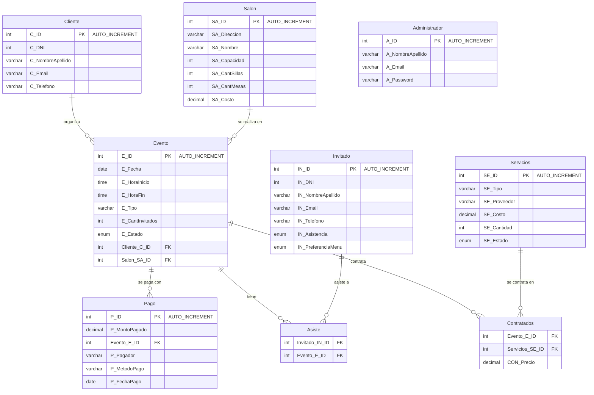

# Diagrama de la Base de Datos — `salonDeEventos`

> GitHub renderiza este bloque Mermaid automáticamente al ver el archivo en el repo.

## Notas

- **`Asiste`** y **`Contratados`** son tablas intermedias que resuelven las relaciones
  N:M entre `Evento`↔`Invitado` y `Evento`↔`Servicios` respectivamente.
- **`Administrador`** no tiene relación con el resto del modelo en el esquema actual;
  se usa únicamente para el login del panel de administración.
- Las claves primarias `C_ID`, `SA_ID`, `E_ID` y `P_ID` ahora son `AUTO_INCREMENT`.
- **Refactor:** La entidad "Reserva" fue fusionada conceptualmente dentro de "Evento" para evitar inconsistencias y unificar el flujo de cobros.
