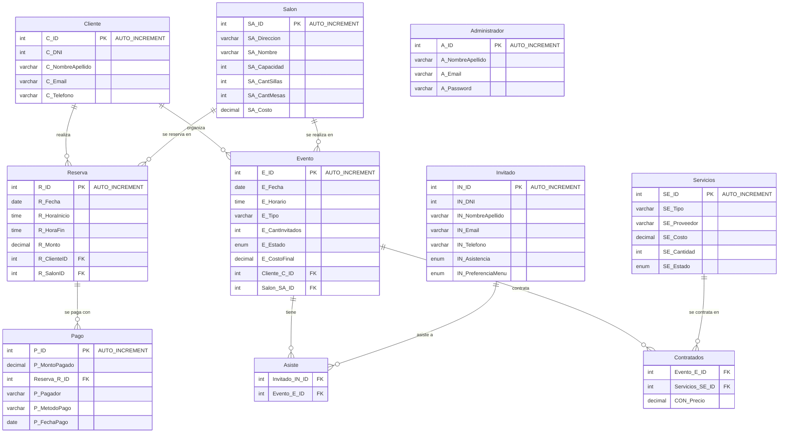

# Diagrama de la Base de Datos — `salonDeEventos`

> GitHub renderiza este bloque Mermaid automáticamente al ver el archivo en el repo.
> Si se necesita visualizarlo en otro formato se puede ver en https://mermaid.ai/d/8fe0f490-fa5b-4b66-bf94-55c072127d8f

## Notas

- **`Asiste`** y **`Contratados`** son tablas intermedias que resuelven las relaciones
  N:M entre `Evento`↔`Invitado` y `Evento`↔`Servicios` respectivamente.
- **`Administrador`** no tiene relación con el resto del modelo en el esquema actual;
  se usa únicamente para el login del panel de administración.
- La vista `VistasEventosConfirmados` (creada en `update_db.sql`) no es una tabla,
  sino una consulta guardada sobre `Evento` ⋈ `Cliente` ⋈ `Salon` filtrada por
  `E_Estado = 'confirmado'`. La usa exclusivamente el panel de Reportes.
- Las claves primarias `C_ID`, `SA_ID`, `E_ID` y `P_ID` ahora son `AUTO_INCREMENT`
  (antes no lo eran, ver `DECISIONES_DISEÑO.md` → "Bugs corregidos").
